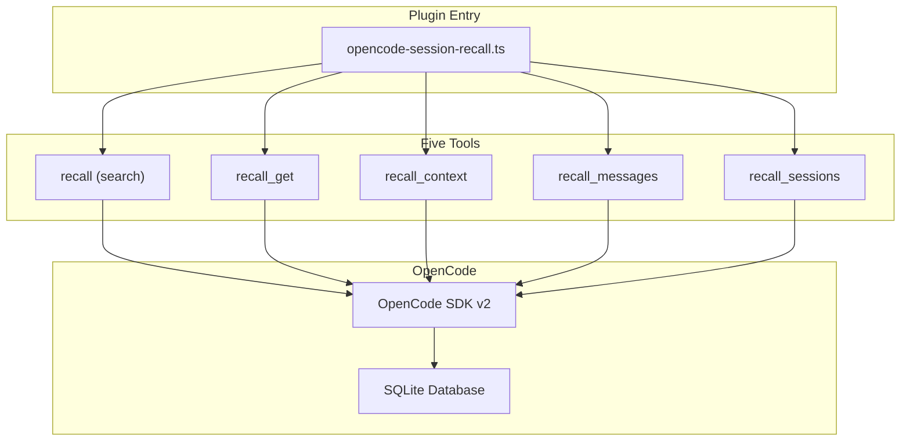
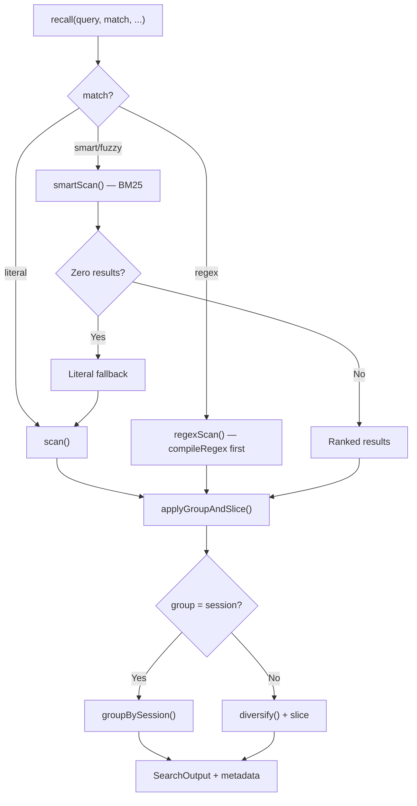
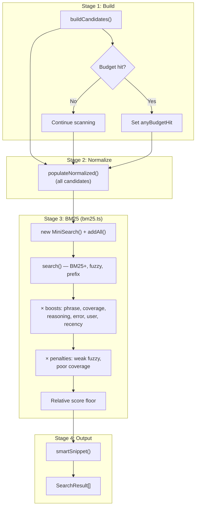
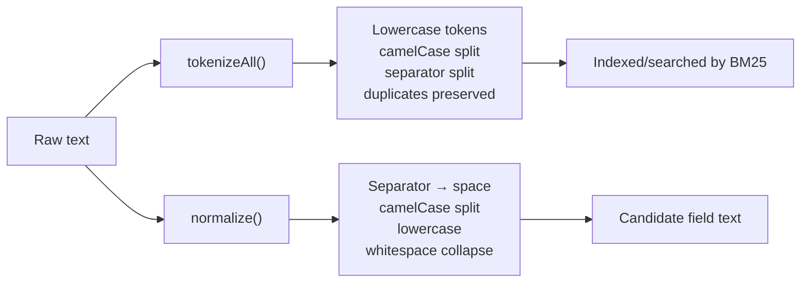
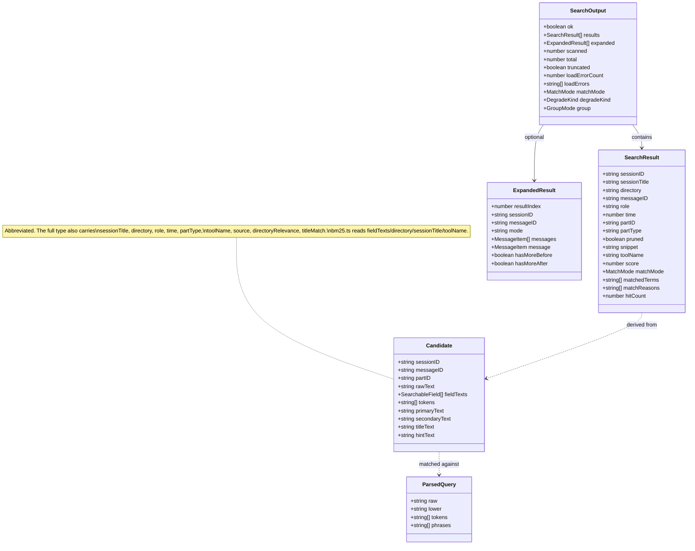

# Contributing to opencode-session-recall

## Development setup

```bash
git clone https://github.com/rmk40/opencode-session-recall.git
cd opencode-session-recall
npm install
npm run typecheck    # type-check without emitting
npm run compile      # build with tsup + tsc declarations
npm run dev          # run in opencode plugin dev mode
```

### Requirements

- Node.js 20+
- TypeScript 6+
- An [OpenCode](https://github.com/opencode-ai/opencode) installation (for live testing)

### Build

The project uses `tsup` for bundling and `tsc` for declaration files. ESM-only (`"type": "module"`). Strict TypeScript with `noUncheckedIndexedAccess`.

```bash
npm run typecheck && npm run compile
```

Output goes to `dist/`. The single entry point is `src/opencode-session-recall.ts`.

## Architecture

### High-level overview



The plugin registers five tools via the OpenCode plugin API, plus optional event hooks for proactive recall (see [Invocation hooks](#invocation-hooks)). All data access goes through the OpenCode SDK — no direct database queries.

### Module map

| Module                       | Purpose                                                                                            |
| ---------------------------- | -------------------------------------------------------------------------------------------------- |
| `opencode-session-recall.ts` | Plugin entry point. Creates SDK clients, registers tools and hooks, injects `primary_tools`        |
| `search.ts`                  | `recall` tool. Literal, regex, and smart/fuzzy paths, filters, expansion, grouping, diversity      |
| `extract.ts`                 | Text extraction from message parts. `searchableFields()` plus `matches()`, `snippet()`, `pruned()` |
| `types.ts`                   | Shared types: search results, expanded entries, message outputs, sessions, and error outputs       |
| `sessions.ts`                | `recall_sessions` tool                                                                             |
| `get.ts`                     | `recall_get` tool                                                                                  |
| `context.ts`                 | `recall_context` tool                                                                              |
| `messages.ts`                | `recall_messages` tool                                                                             |
| `normalize.ts`               | Tokenizers/normalizer: `tokenizeAll()` (dup-preserving, for BM25) and `tokenize()` (deduped)       |
| `query.ts`                   | Query parsing: `parseQuery()` → `ParsedQuery` with raw, lower, tokens, phrases                     |
| `candidates.ts`              | Candidate construction from messages/parts with budget enforcement                                 |
| `bm25.ts`                    | BM25 relevance ranking (MiniSearch) with structural boosts/penalties                               |
| `regex.ts`                   | `regex` match mode: pattern compile, bounded scan, match snippet                                   |
| `route.ts`                   | Query-shape classification (`looksLikeRegex`, `classifyQuery`) that drives mode suggestions        |
| `snippet.ts`                 | Token-density sliding window snippet selection                                                     |
| `hooks/system-nudge.ts`      | `nudge` option: system-prompt reminder to use recall                                               |
| `hooks/auto-recall.ts`       | `autoRecall` option: bounded auto-search on `chat.message`, injects cited hits                     |
| `hooks/compaction-recall.ts` | `compactionRecall` option: preserves durable findings into the compaction summary                  |
| `hooks/part-id.ts`           | Generates opencode-compatible ascending `prt_` part IDs for injected synthetic parts               |

### Search paths

The `recall` tool has three distinct execution paths, selected by `match`:



**Literal path** (`match: "literal"`, the default): `scan()` iterates messages → parts → `searchableFields()` → `matches()` (case-insensitive `includes`). Stops once enough results are collected (the part path over-collects for diversity; grouped mode scans broadly). Available for all scopes.

**Regex path** (`match: "regex"`): The pattern is compiled once with `compileRegex()` up front — an invalid pattern is a hard error before any scanning. `regexScan()`/`regexScanAll()` mirror the literal scanners but match with the compiled `RegExp` and build snippets via `regexSnippet()`. Bypasses BM25. Field text is length-capped per match; there is no per-match timeout (see `regex.ts` header).

**Smart/fuzzy path** (`match: "smart"` or `"fuzzy"`): The multi-stage `smartScan()` BM25 pipeline. Returns all ranked results; the caller slices and optionally groups. Falls back to the literal path if it finds nothing, so smart/fuzzy results that came from the fallback carry literal semantics (no `score`/`matchedTerms`).

**Session grouping** (`group: "session"`): `groupBySession()` collapses results to one entry per session with the best-scoring (smart/fuzzy) or most-recent (literal/regex) hit as representative, plus `hitCount`. In part mode, `diversify()` instead caps how many hits a single session contributes to the initial fill so one noisy session can't flood the list.

**Expansion** (`expand: "context"` or `"message"`): After filtering, grouping, and slicing, `expandSearchResults()` attaches an `expanded` array for the first `expandResults` final results. Context expansion marks the matched message with `center: true` and includes `hasMoreBefore` / `hasMoreAfter`.

### Invocation hooks

Besides the five tools, the plugin optionally registers OpenCode event hooks so the agent uses recall proactively. They are wired in `opencode-session-recall.ts` and gated by plugin options. Each hook is fully wrapped in `try/catch`: OpenCode runs hooks through `Effect.promise`, where a thrown hook becomes a fatal defect, so the hooks must never throw.

| Hook                                 | Option (default)         | Module                       | Behavior                                                                                                |
| ------------------------------------ | ------------------------ | ---------------------------- | ------------------------------------------------------------------------------------------------------- |
| `experimental.chat.system.transform` | `nudge` (on)             | `hooks/system-nudge.ts`      | Pushes one reminder string onto `output.system`; idempotent via a sentinel; guards entry types          |
| `chat.message`                       | `autoRecall` (off)       | `hooks/auto-recall.ts`       | Cue-gated bounded recall; injects a cited synthetic text part into `output.parts`                       |
| `experimental.session.compacting`    | `compactionRecall` (off) | `hooks/compaction-recall.ts` | Session-scoped durable-signal recall; appends one cited block to `output.context` (never sets `prompt`) |

The two search-running hooks (`autoRecall`, `compactionRecall`) each build their own `search()` tool instance and call its `execute` with a synthetic `ToolContext`. The search is bounded by a 1.5-second wall-clock timeout (`AbortController` + `Promise.race`, single timer cleared in `finally`); `autoRecall` also caps the scan at `sessions: 200`. `autoRecall` injects a `synthetic: true` text part carrying a real `prt_` id from `hooks/part-id.ts`, because the hook fires after OpenCode has already assigned ids to the message's other parts.

### Smart/fuzzy pipeline



#### Stage 1: Candidate construction (`candidates.ts`)

Messages are scanned newest-first. For each message part, `searchableFields()` extracts the searchable field texts and they are joined as `rawText`. `tokenize()` produces a deduplicated token set used for matched-term metadata. Budgets enforced during construction:

| Budget                    | Default   | Purpose                         |
| ------------------------- | --------- | ------------------------------- |
| `maxCandidatesPerSession` | 500       | Cap per-session candidates      |
| `maxCandidatesTotal`      | 3000      | Global candidate cap            |
| `maxCharsPerCandidate`    | 20,000    | Truncate very long tool outputs |
| `maxCharsTotal`           | 2,000,000 | Total text budget               |
| `maxMessagesPerSession`   | 1000      | Message scan limit              |
| `maxPartsPerSession`      | 5000      | Part scan limit                 |

Note: when the candidate cap is hit the array is truncated in scan order (newest sessions/parts first), not by query relevance — BM25 then ranks whatever is in the index.

#### Stage 2: Normalization (`normalize.ts`)

All candidates get their indexed fields populated by `populateNormalized()`:

- `primaryText`: `normalize(rawText)` — camelCase splitting, separator → space, lowercase, whitespace collapse
- `secondaryText`: `normalize(directory)` — project directory for cross-project context
- `titleText`: `normalize(sessionTitle)` — session title
- `hintText`: `normalize(toolName)` — tool name identifiers

There is no separate prefilter survival gate — the BM25 index itself selects matching documents.

#### Stage 3: BM25 ranking (`bm25.ts`)

A fresh in-memory MiniSearch index is built per query over all candidates and discarded after. This is intentional and cheap (histories load fast; there is no persistent cache by design). MiniSearch provides BM25+ scoring, which weights rare terms (IDF) and normalizes for document length.

The index tokenizes with `tokenizeAll()` (the duplicate-preserving tokenizer, so term frequency stays meaningful). Field boosts:

| Field           | Boost | Source                       |
| --------------- | ----- | ---------------------------- |
| `primaryText`   | 2     | Normalized message/tool text |
| `secondaryText` | 0.6   | Normalized project directory |
| `titleText`     | 0.3   | Normalized session title     |
| `hintText`      | 0.15  | Normalized tool name         |

Search options: `combineWith: "OR"`, `prefix` for terms > 3 chars, and `fuzzy` for terms ≥ 4 chars (edit-distance fraction 0.2 for smart, 0.3 for fuzzy, capped by `maxFuzzy: 6`).

BM25 scores are normalized to 0..1 relative to the top hit, then adjusted by **multiplicative** structural boosts/penalties (converted from the prior additive model):

| Signal             | Multiplier | Condition                                  |
| ------------------ | ---------- | ------------------------------------------ |
| Exact phrase       | ×1.15      | Quoted phrase found verbatim in raw text   |
| All tokens matched | ×1.10      | Every query token present (exact or fuzzy) |
| Reasoning part     | ×1.05      | Part type is `reasoning`                   |
| Error text         | ×1.05      | Tool output contains error-like patterns   |
| User role          | ×1.03      | Message authored by user                   |
| Recency            | ×1.00–1.05 | Decays linearly over 1 week                |
| Weak single fuzzy  | ×0.90      | Single match, relative score < 0.7         |
| Poor coverage      | ×0.92      | < 50% of query tokens matched              |

A relative score floor (`MIN_RELATIVE_SCORE`) drops trailing noise from OR-combined weak single-term matches, but never drops the only/best hit. Results sort by score, then recency, then `partID` for deterministic ties. When `explain: true`, each adjustment is recorded in `matchReasons`.

Quoted phrases are soft signals, not hard constraints: `parseQuery()` turns them into ordinary tokens for BM25, and the exact-phrase multiplier rewards documents whose raw text contains the verbatim phrase.

#### Stage 4: Snippet selection (`snippet.ts`)

`smartSnippet()` finds all positions of query tokens and phrases in the raw text, then uses a sliding window to select the span with the most distinct token matches. The window is centered on the densest cluster.

### Text normalization



- `tokenizeAll()`: duplicate-preserving tokenizer used by the BM25 index and search so term frequency is meaningful.
- `tokenize()`: deduplicated variant used for set-membership checks (matched-term/field detection, query token uniqueness).
- `normalize()`: whitespace-collapsed normalized string used to populate the candidate fields the index reads.

### Dependencies

| Package               | Version | Purpose                                                           |
| --------------------- | ------- | ----------------------------------------------------------------- |
| `@opencode-ai/sdk`    | ^1.3.2  | OpenCode API client                                               |
| `minisearch`          | ^7.2.0  | BM25 relevance ranking for smart/fuzzy search                     |
| `fastest-levenshtein` | ^1.0.16 | Edit-distance for matched-term detection                          |
| `zod`                 | ^4.3.6  | Schema validation backing the `tool.schema` builder for tool args |

Peer dependency: `@opencode-ai/plugin` >= 1.2.0

### Type hierarchy

Key types across the codebase (`types.ts`, `candidates.ts`, `query.ts`):



### Extending

#### Adding smart/fuzzy performance benchmarks for new scopes

Smart/fuzzy search works across all scopes. When optimizing for larger scopes (more sessions), benchmark:

1. Candidate construction time and memory at scale
2. BM25 index build + search cost at high candidate counts
3. Post-fetch ranking latency against the 2-second budget in `smartScan()` (which starts after session discovery/loading, not at request entry). For the `autoRecall`/`compactionRecall` hooks, the relevant cap is their own 1.5-second wall-clock timeout.

When changing ranking, re-run the relevance eval (`test/eval/`) — it gates MRR and recall@5 against `baseline.json` over a labeled corpus, so regressions fail the build.

#### Tuning ranking

All ranking constants are at the top of `bm25.ts`:

- `EXACT_PHRASE_MULT`, `ALL_TOKENS_MULT`, `REASONING_MULT`, etc. (multiplicative structural boosts)
- `RECENCY_WINDOW_MS` controls how fast the recency boost decays
- `MIN_RELATIVE_SCORE` controls how aggressively weak OR-combined matches are dropped
- `fuzzyFor()` controls smart vs. fuzzy edit-distance tolerance

#### Adding a new tool

1. Create a new file in `src/` following the pattern in `get.ts` or `context.ts`
2. Export a function that takes SDK clients and returns a `ToolDefinition`
3. Register it in `opencode-session-recall.ts`
4. Add the tool name to the `TOOLS` array in `types.ts`

## Commit conventions

This project follows [Conventional Commits](https://www.conventionalcommits.org/):

```
<type>(scope): <summary>

<body>
```

Types: `feat`, `fix`, `docs`, `refactor`, `perf`, `test`, `chore`

Common scopes: `recall`, `search`, `bm25`, `snippet`, `types`

## License

MIT — see [LICENSE](LICENSE) for details.
