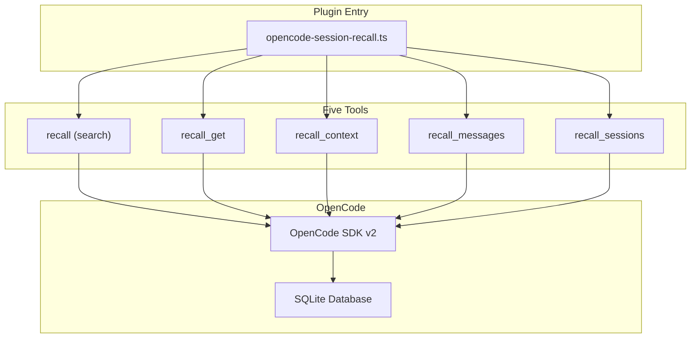
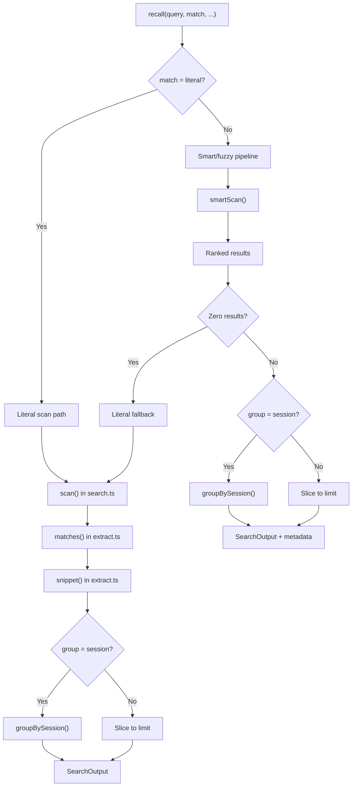
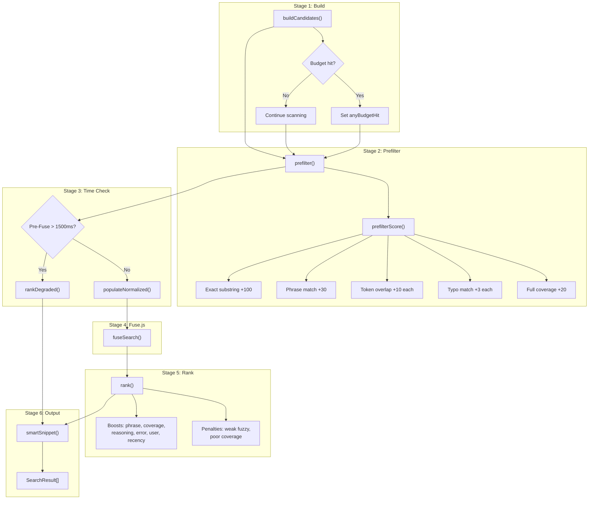
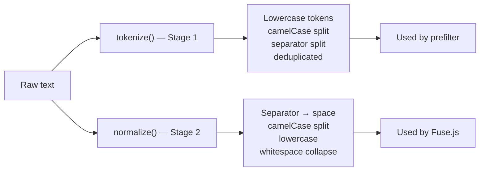
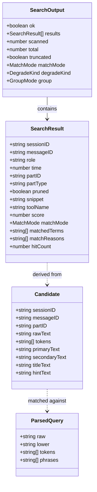

# Contributing to opencode-session-recall

## Development setup

```bash
git clone https://github.com/rmk40/opencode-session-recall.git
cd opencode-session-recall
npm install
npm run typecheck    # type-check without emitting
npm run compile      # build with tsup + tsc declarations
npm run dev          # run in opencode plugin dev mode
```

### Requirements

- Node.js 20+
- TypeScript 6+
- An [OpenCode](https://github.com/opencode-ai/opencode) installation (for live testing)

### Build

The project uses `tsup` for bundling and `tsc` for declaration files. ESM-only (`"type": "module"`). Strict TypeScript with `noUncheckedIndexedAccess`.

```bash
npm run typecheck && npm run compile
```

Output goes to `dist/`. The single entry point is `src/opencode-session-recall.ts`.

## Architecture

### High-level overview



The plugin registers five tools via the OpenCode plugin API. All data access goes through the OpenCode SDK — no direct database queries.

### Module map

| Module                       | Lines | Purpose                                                                                  |
| ---------------------------- | ----- | ---------------------------------------------------------------------------------------- |
| `opencode-session-recall.ts` | 87    | Plugin entry point. Creates SDK clients, registers tools, injects `primary_tools` config |
| `search.ts`                  | 726   | `recall` tool. Literal scan, smart/fuzzy pipeline, session grouping, load-error metadata |
| `extract.ts`                 | 156   | Text extraction from message parts. `searchable()`, `matches()`, `snippet()`, `pruned()` |
| `types.ts`                   | 179   | Shared types: `SearchResult`, `SearchOutput`, `MatchMode`, `DegradeKind`, `GroupMode`    |
| `sessions.ts`                | 132   | `recall_sessions` tool                                                                   |
| `get.ts`                     | 77    | `recall_get` tool                                                                        |
| `context.ts`                 | 125   | `recall_context` tool                                                                    |
| `messages.ts`                | 140   | `recall_messages` tool                                                                   |
| `normalize.ts`               | 23    | Two-stage text normalization: `tokenize()` (stage 1) and `normalize()` (stage 2)         |
| `query.ts`                   | 44    | Query parsing: `parseQuery()` → `ParsedQuery` with raw, lower, tokens, phrases           |
| `candidates.ts`              | 186   | Candidate construction from messages/parts with budget enforcement                       |
| `prefilter.ts`               | 95    | Cheap lexical prefiltering with edit-distance typo gate                                  |
| `fuse.ts`                    | 67    | Fuse.js wrapper with weighted keys and threshold configuration                           |
| `rank.ts`                    | ~275  | Structural re-ranking with boosts/penalties on top of Fuse scores                        |
| `snippet.ts`                 | 150   | Token-density sliding window snippet selection                                           |

### Search paths

The `recall` tool has two distinct execution paths:



**Literal path** (`match: "literal"`, the default): Uses the original `scan()` function. Iterates messages → parts → `searchable()` → `matches()` (case-insensitive `includes`). Stops early when the result limit is reached (or collects up to 1000 when grouping by session). Available for all scopes.

**Smart/fuzzy path** (`match: "smart"` or `"fuzzy"`): Uses the multi-stage `smartScan()` pipeline. Returns all ranked results; the caller handles slicing and optional session grouping. Available for all scopes. Falls back to literal if zero results.

**Session grouping** (`group: "session"`): After results are collected, `groupBySession()` collapses them — one entry per session with the best-scoring (smart/fuzzy) or most-recent (literal) hit as representative, plus `hitCount` showing how many part-level hits that session had.

### Smart/fuzzy pipeline



#### Stage 1: Candidate construction (`candidates.ts`)

Messages are scanned newest-first. For each message part, `searchable()` extracts text arrays and all texts are joined as `rawText`. Stage-1 tokenization (`tokenize()`) produces lightweight tokens for prefiltering. Budgets enforced during construction:

| Budget                    | Default   | Purpose                         |
| ------------------------- | --------- | ------------------------------- |
| `maxCandidatesPerSession` | 500       | Cap per-session candidates      |
| `maxCandidatesTotal`      | 3000      | Global candidate cap            |
| `maxCharsPerCandidate`    | 20,000    | Truncate very long tool outputs |
| `maxCharsTotal`           | 2,000,000 | Total text budget               |
| `maxMessagesPerSession`   | 1000      | Message scan limit              |
| `maxPartsPerSession`      | 5000      | Part scan limit                 |

#### Stage 2: Prefiltering (`prefilter.ts`)

Cheap lexical gate. Each candidate gets a `prefilterScore`:

- **Exact raw substring** of the full query → +100
- **Quoted phrase** present → +30 each
- **Token overlap** (substring match) → +10 each
- **Typo match** (edit distance ≤ 1, tokens ≥ 4 chars) → +3 each
- **Full coverage** (all tokens matched) → +20

Only candidates with score > 0 survive. If survivors exceed the candidate cap, the highest-scoring are kept.

#### Stage 3: Time budget check

If pre-Fuse processing exceeds 1500ms (provisional, calibrated from benchmarks), the pipeline skips Fuse.js and returns `rankDegraded()` results with `degradeKind: "time"`.

#### Stage 4: Normalization + Fuse.js (`normalize.ts`, `fuse.ts`)

Surviving candidates get stage-2 normalization:

- `primaryText`: `normalize(rawText)` — camelCase splitting, separator → space, lowercase, whitespace collapse
- `secondaryText`: `normalize(directory)` — project directory for cross-project context
- `titleText`: `normalize(sessionTitle)` — session title
- `hintText`: `normalize(toolName)` — tool name identifiers

Fuse.js searches with weighted keys:

| Key             | Weight | Source                       |
| --------------- | ------ | ---------------------------- |
| `primaryText`   | 0.65   | Normalized message/tool text |
| `secondaryText` | 0.20   | Normalized project directory |
| `titleText`     | 0.10   | Normalized session title     |
| `hintText`      | 0.05   | Normalized tool name         |

Thresholds: 0.3 for smart, 0.5 for fuzzy. `ignoreLocation` and `ignoreFieldNorm` are enabled so long texts aren't penalized.

#### Stage 5: Structural re-ranking (`rank.ts`)

Fuse scores (inverted: 1 = best) are adjusted with deterministic boosts and penalties:

| Signal             | Value      | Condition                                  |
| ------------------ | ---------- | ------------------------------------------ |
| Exact phrase       | +0.15      | Quoted phrase found verbatim in raw text   |
| All tokens matched | +0.10      | Every query token present (exact or typo)  |
| Reasoning part     | +0.05      | Part type is `reasoning`                   |
| Error text         | +0.05      | Tool output contains error-like patterns   |
| User role          | +0.03      | Message authored by user                   |
| Recency            | +0.00–0.05 | Decays linearly over 1 week                |
| Weak single fuzzy  | -0.10      | Single fuzzy match, normalized score < 0.7 |
| Poor coverage      | -0.08      | < 50% of query tokens matched              |

When `explain: true`, each boost/penalty is recorded in `matchReasons`.

#### Stage 6: Snippet selection (`snippet.ts`)

`smartSnippet()` finds all positions of query tokens and phrases in the raw text, then uses a sliding window to select the span with the most distinct token matches. The window is centered on the densest cluster.

### Two-stage normalization

The pipeline uses two levels of text processing to balance speed and match quality:



**Stage 1** (`tokenize`): Applied during candidate construction. Cheap — lowercase, split on separators and camelCase boundaries, deduplicate. Produces tokens for prefilter matching.

**Stage 2** (`normalize`): Applied only to prefilter survivors. More expensive — full normalization for Fuse.js field matching. Applied to both candidate fields and the Fuse query string.

### Dependencies

| Package               | Version | Purpose                                                            |
| --------------------- | ------- | ------------------------------------------------------------------ |
| `@opencode-ai/sdk`    | ^1.3.2  | OpenCode API client                                                |
| `fuse.js`             | ^7.3.0  | Fuzzy search and ranking                                           |
| `fastest-levenshtein` | ^1.0.16 | Edit-distance for typo detection in prefilter                      |
| `zod`                 | ^4.3.6  | Schema validation (used by `@opencode-ai/plugin` tool definitions) |

Peer dependency: `@opencode-ai/plugin` >= 1.2.0

### Type hierarchy

Key types across the codebase (`types.ts`, `candidates.ts`, `query.ts`):



### Extending

#### Adding smart/fuzzy performance benchmarks for new scopes

Smart/fuzzy search works across all scopes. When optimizing for larger scopes (more sessions), benchmark:

1. Candidate construction time and memory at scale
2. Prefilter survival rates for broad queries
3. Fuse.js indexing cost at high candidate counts
4. End-to-end latency within the 2-second time budget

#### Tuning ranking

All ranking constants are at the top of `rank.ts`:

- `EXACT_PHRASE_BOOST`, `ALL_TOKENS_BOOST`, `REASONING_BOOST`, etc.
- `RECENCY_WINDOW_MS` controls how fast the recency boost decays
- `SMART_THRESHOLD` and `FUZZY_THRESHOLD` in `fuse.ts` control match strictness

#### Adding a new tool

1. Create a new file in `src/` following the pattern in `get.ts` or `context.ts`
2. Export a function that takes SDK clients and returns a `ToolDefinition`
3. Register it in `opencode-session-recall.ts`
4. Add the tool name to the `TOOLS` array in `types.ts`

## Commit conventions

This project follows [Conventional Commits](https://www.conventionalcommits.org/):

```
<type>(scope): <summary>

<body>
```

Types: `feat`, `fix`, `docs`, `refactor`, `perf`, `test`, `chore`

Common scopes: `recall`, `search`, `rank`, `fuse`, `prefilter`, `snippet`, `types`

## License

MIT — see [LICENSE](LICENSE) for details.
