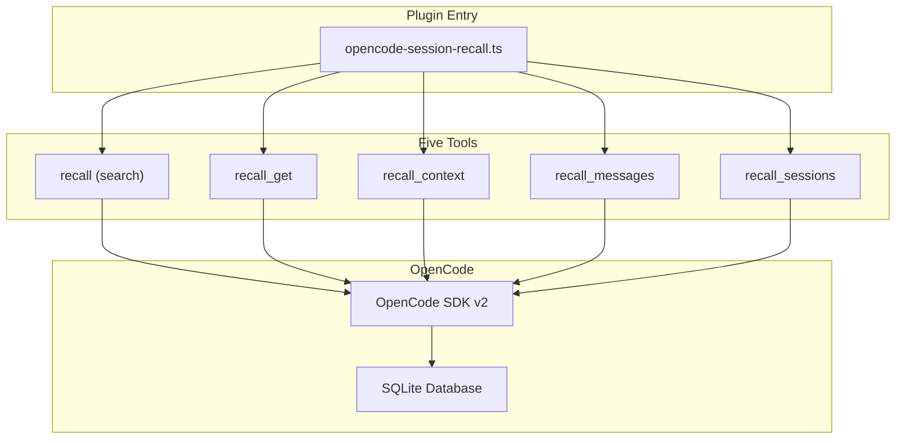
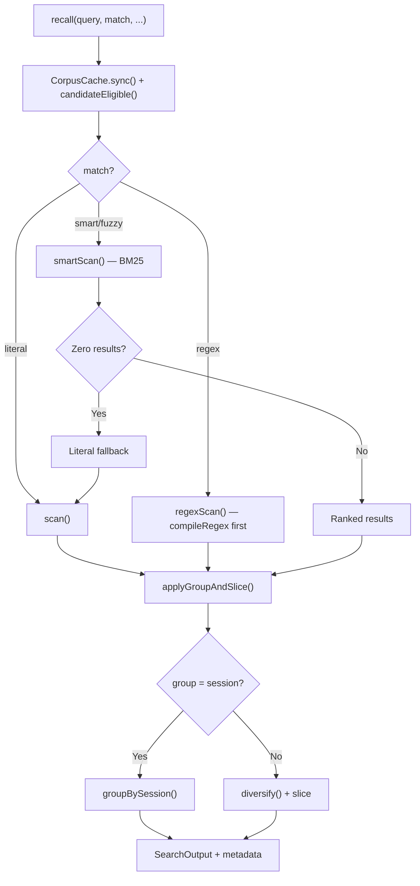
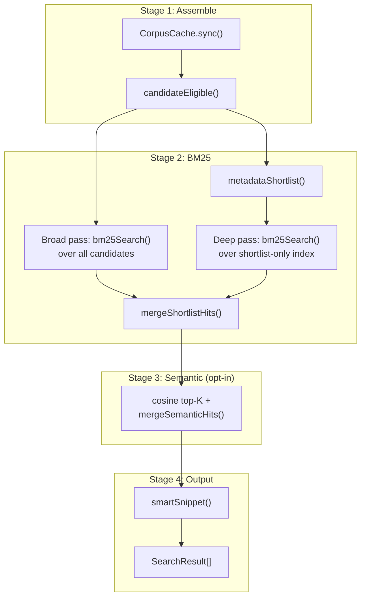
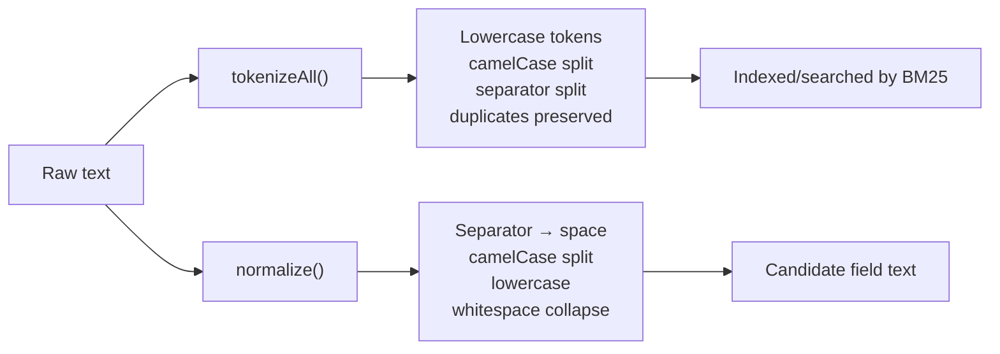
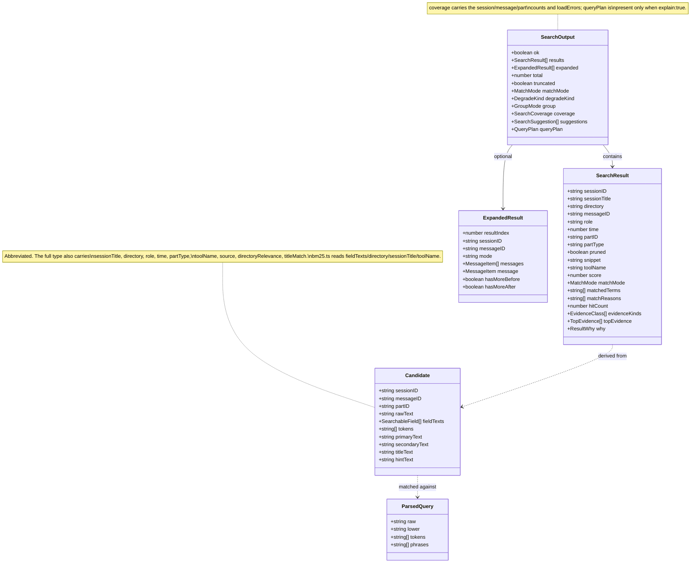

# Contributing to opencode-session-recall

## Development setup

```bash
git clone https://github.com/rmk40/opencode-session-recall.git
cd opencode-session-recall
npm install
npm run typecheck    # type-check without emitting
npm run compile      # build with tsup + tsc declarations
npm run dev          # run in opencode plugin dev mode
```

### Requirements

- Node.js 20+
- TypeScript 6+
- An [OpenCode](https://github.com/opencode-ai/opencode) installation (for live testing)

### Build

The project uses `tsup` for bundling and `tsc` for declaration files. ESM-only (`"type": "module"`). Strict TypeScript with `noUncheckedIndexedAccess`.

```bash
npm run typecheck && npm run compile
```

Output goes to `dist/`. The single entry point is `src/opencode-session-recall.ts`.

## Architecture

### High-level overview


```mermaid
flowchart TB
    subgraph "Plugin Entry"
        Entry["opencode-session-recall.ts"]
    end

    subgraph "Five Tools"
        Recall["recall (search)"]
        Get["recall_get"]
        Context["recall_context"]
        Messages["recall_messages"]
        Sessions["recall_sessions"]
    end

    subgraph "OpenCode"
        SDK["OpenCode SDK v2"]
        DB["SQLite Database"]
    end

    Entry --> Recall
    Entry --> Get
    Entry --> Context
    Entry --> Messages
    Entry --> Sessions

    Recall --> SDK
    Get --> SDK
    Context --> SDK
    Messages --> SDK
    Sessions --> SDK

    SDK --> DB
```

The plugin registers five tools via the OpenCode plugin API, plus optional event hooks for proactive recall (see [Invocation hooks](#invocation-hooks)). All data access goes through the OpenCode SDK — no direct database queries.

### Module map

| Module                       | Purpose                                                                                       |
| ---------------------------- | --------------------------------------------------------------------------------------------- |
| `opencode-session-recall.ts` | Plugin entry point. Creates SDK clients, the shared `CorpusCache`, registers tools and hooks  |
| `search.ts`                  | `recall` tool. Literal, regex, and smart/fuzzy paths, filters, expansion, grouping, diversity |
| `corpus.ts`                  | Incremental in-memory corpus cache (sync, LRU eviction, pinning) plus session digests         |
| `extract.ts`                 | Text extraction from message parts. `searchableFields()`, `matches()`, `evidenceClassFor()`   |
| `types.ts`                   | Shared types: search results, expanded entries, message outputs, sessions, and error outputs  |
| `sessions.ts`                | `recall_sessions` tool                                                                        |
| `get.ts`                     | `recall_get` tool                                                                             |
| `context.ts`                 | `recall_context` tool                                                                         |
| `messages.ts`                | `recall_messages` tool                                                                        |
| `normalize.ts`               | Tokenizers/normalizer: `tokenizeAll()` (dup-preserving, for BM25) and `tokenize()` (deduped)  |
| `query.ts`                   | Query parsing: `parseQuery()` → `ParsedQuery` with raw, lower, tokens, phrases, codeTokens    |
| `candidates.ts`              | Candidate construction at cache-fill time; `candidateEligible()` query-time filter predicate  |
| `bm25.ts`                    | BM25 relevance ranking (MiniSearch) with structural boosts/penalties                          |
| `plan.ts`                    | Two-stage session-first plan: metadata shortlist plus shortlist-index merge                   |
| `semantic/embedder.ts`       | Opt-in static-embedding model: download, load, embed (the only Node-touching module)          |
| `semantic/similarity.ts`     | Brute-force cosine top-K over candidate embeddings                                            |
| `regex.ts`                   | `regex` match mode: pattern compile, bounded scan, match snippet                              |
| `route.ts`                   | Query-shape classification (`looksLikeRegex`, `classifyQuery`) that drives mode suggestions   |
| `snippet.ts`                 | Token-density sliding window snippet selection                                                |
| `hooks/system-nudge.ts`      | `nudge` option: system-prompt reminder to use recall                                          |
| `hooks/auto-recall.ts`       | `autoRecall` option: bounded auto-search on `chat.message`, injects cited hits                |
| `hooks/compaction-recall.ts` | `compactionRecall` option: preserves durable findings into the compaction summary             |
| `hooks/part-id.ts`           | Generates opencode-compatible ascending `prt_` part IDs for injected synthetic parts          |

### Search paths

Every search starts with a cache sync: `CorpusCache.sync()` diffs the target sessions against the cache by `(id, updated)`, fetches only changed or missing ones through the SDK, and returns each session's pre-built candidates. Query-time filters (`type`, `role`, `before`/`after`, `toolName`) are applied by the pure predicate `candidateEligible()` when assembling the per-query candidate list. From there, three distinct execution paths, selected by `match`:


```mermaid
flowchart TB
    Start["recall(query, match, ...)"] --> Sync["CorpusCache.sync() + candidateEligible()"]
    Sync --> Guard{"match?"}

    Guard -->|literal| Literal["scan()"]
    Guard -->|regex| Regex["regexScan() — compileRegex first"]
    Guard -->|smart/fuzzy| Smart["smartScan() — BM25"]

    Smart --> FallbackCheck{"Zero results?"}
    FallbackCheck -->|Yes| Fallback["Literal fallback"]
    FallbackCheck -->|No| Ranked["Ranked results"]
    Fallback --> Literal

    Literal --> GroupSlice["applyGroupAndSlice()"]
    Regex --> GroupSlice
    Ranked --> GroupSlice

    GroupSlice --> GroupCheck{"group = session?"}
    GroupCheck -->|Yes| Group["groupBySession()"]
    GroupCheck -->|No| Diversify["diversify() + slice"]

    Group --> Out["SearchOutput + metadata"]
    Diversify --> Out
```

**Literal path** (`match: "literal"`, the default): `scan()` iterates the cached candidates' field texts (the same `searchableFields()` output, built at cache-fill time) → `matches()` (case-insensitive `includes`). Stops once enough results are collected (the part path over-collects for diversity; grouped mode scans broadly). Available for all scopes.

**Regex path** (`match: "regex"`): The pattern is compiled once with `compileRegex()` up front — an invalid pattern is a hard error before any scanning. `regexScan()`/`regexScanAll()` mirror the literal scanners over the same cached candidates but match with the compiled `RegExp` and build snippets via `regexSnippet()`. Bypasses BM25. Field text is length-capped per match; there is no per-match timeout (see `regex.ts` header).

**Smart/fuzzy path** (`match: "smart"` or `"fuzzy"`): The multi-stage `smartScan()` BM25 pipeline, including the two-stage shortlist merge and the opt-in semantic merge (see [Smart/fuzzy pipeline](#smartfuzzy-pipeline)). Returns all ranked results; the caller slices and optionally groups. Falls back to the literal path if it finds nothing, so smart/fuzzy results that came from the fallback carry literal semantics (no `score`/`matchedTerms`).

**Session grouping** (`group: "session"`): `groupBySession()` collapses results to one entry per session, plus `hitCount`, `evidenceKinds`, and up to two `topEvidence` snippets of other evidence classes. The representative is chosen by evidence-class priority (`CLASS_PRIORITY`: human-text and tool-input before file-read and skill-definition) among the tracked hits within `REPRESENTATIVE_TOLERANCE` of the session's best score, so a session isn't represented by its skill payload when a command hit scores nearly as well. In part mode, `diversify()` caps how many hits a single session contributes to the initial fill, and a final `capAndSlice()` pass caps generated reference material per class (`CLASS_CAPS`: one skill-definition, two file-read) and guarantees one tool-input hit for command-like queries.

**Expansion** (`expand: "context"` or `"message"`): After filtering, grouping, and slicing, `expandSearchResults()` fetches messages on demand for only the expanded sessions and attaches an `expanded` array for the first `expandResults` final results. Context expansion marks the matched message with `center: true` and includes `hasMoreBefore` / `hasMoreAfter`. Each part is capped at `MAX_EXPANDED_PART_CHARS` (6,000) within the total budget; when the matched part itself is truncated, `truncatePreservingMatch()` (`snippet.ts`) keeps the head plus a window around the match instead of head-slicing the match away.

### Invocation hooks

Besides the five tools, the plugin optionally registers OpenCode event hooks so the agent uses recall proactively. They are wired in `opencode-session-recall.ts` and gated by plugin options. Each hook is fully wrapped in `try/catch`: OpenCode runs hooks through `Effect.promise`, where a thrown hook becomes a fatal defect, so the hooks must never throw.

| Hook                                 | Option (default)         | Module                       | Behavior                                                                                                |
| ------------------------------------ | ------------------------ | ---------------------------- | ------------------------------------------------------------------------------------------------------- |
| `experimental.chat.system.transform` | `nudge` (on)             | `hooks/system-nudge.ts`      | Pushes one reminder string onto `output.system`; idempotent via a sentinel; guards entry types          |
| `chat.message`                       | `autoRecall` (off)       | `hooks/auto-recall.ts`       | Cue-gated bounded recall; injects a cited synthetic text part into `output.parts`                       |
| `experimental.session.compacting`    | `compactionRecall` (off) | `hooks/compaction-recall.ts` | Session-scoped durable-signal recall; appends one cited block to `output.context` (never sets `prompt`) |

The two search-running hooks (`autoRecall`, `compactionRecall`) each build their own `search()` tool instance and call its `execute` with a synthetic `ToolContext`. The search is bounded by a 1.5-second wall-clock timeout (`AbortController` + `Promise.race`, single timer cleared in `finally`). All three search call sites (the `recall` tool and both hooks) share one `CorpusCache`, so any of them warms the cache for all; a cold first hook search on a large history may time out and inject nothing, and the next attempt hits a warm cache (the `prewarm` option syncs the cache at plugin init instead). `autoRecall` injects a `synthetic: true` text part carrying a real `prt_` id from `hooks/part-id.ts`, because the hook fires after OpenCode has already assigned ids to the message's other parts.

### Smart/fuzzy pipeline


```mermaid
flowchart TB
    subgraph "Stage 1: Assemble"
        Sync["CorpusCache.sync()"]
        Sync --> Filter["candidateEligible()"]
    end

    subgraph "Stage 2: BM25"
        Broad["Broad pass: bm25Search()<br/>over all candidates"]
        Shortlist["metadataShortlist()"]
        Shortlist --> Deep["Deep pass: bm25Search()<br/>over shortlist-only index"]
        Broad --> Merge["mergeShortlistHits()"]
        Deep --> Merge
    end

    subgraph "Stage 3: Semantic (opt-in)"
        Sem["cosine top-K +<br/>mergeSemanticHits()"]
    end

    subgraph "Stage 4: Output"
        Snippet["smartSnippet()"]
        Snippet --> Results["SearchResult[]"]
    end

    Filter --> Broad
    Filter --> Shortlist
    Merge --> Sem
    Sem --> Snippet
```

#### Stage 1: Cache sync and assembly (`corpus.ts`, `candidates.ts`)

`CorpusCache.sync()` diffs the target sessions against the cache by `(id, updated)` and fetches only changed or missing ones. For each fetched session, `buildCandidates()` scans messages newest-first: `searchableFields()` extracts each part's field texts (joined as `rawText`), `tokenize()` produces the deduplicated token set, and `populateNormalized()` fills the indexed fields (camelCase splitting, separator → space, lowercase, whitespace collapse) — all once per session version, so tokenization cost is paid per session change, not per query. Query-time filters (`type`, `role`, `before`/`after`, `toolName`) are the pure predicate `candidateEligible()`, applied when assembling the per-query pool. There is no separate prefilter survival gate — the BM25 index itself selects matching documents.

There are no per-query candidate budgets and no scan-order truncation — search is complete over the eligible scope. The remaining size controls:

| Limit                     | Default    | Purpose                                             |
| ------------------------- | ---------- | --------------------------------------------------- |
| `cacheMaxChars`           | 50,000,000 | Total raw-text budget for the cache (plugin option) |
| `MAX_CHARS_PER_CANDIDATE` | 20,000     | Truncate very long tool outputs per candidate       |

Cache correctness rules (see the `corpus.ts` header): LRU eviction only ever affects latency, never results (an evicted session is re-fetched when targeted again); sessions belonging to an in-flight `sync()` are pinned against eviction until the query releases them; an unknown `updated` (a failed `session.get`) bypasses the cache and is never stored; concurrent syncs of the same session share one fetch. Cache fill also computes each session's `digestText` (the first user message's head plus the session's characteristic action vocabulary — file reads and skill payloads earn no digest credit) and, when the semantic embedder is enabled and warm, each candidate's embedding.

#### Stage 2: BM25 ranking, broad and deep (`bm25.ts`, `plan.ts`)

A fresh in-memory MiniSearch index is built per query over the assembled candidates and discarded after (the candidates are cached in `CorpusCache`; the index is not). MiniSearch provides BM25+ scoring, which weights rare terms (IDF) and normalizes for document length.

The index tokenizes with `tokenizeAll()` (the duplicate-preserving tokenizer, so term frequency stays meaningful). Field boosts:

| Field           | Boost | Source                         |
| --------------- | ----- | ------------------------------ |
| `primaryText`   | 2     | Normalized message/tool text   |
| `secondaryText` | 0.6   | Normalized project directory   |
| `digestText`    | 0.4   | Content-derived session digest |
| `titleText`     | 0.3   | Normalized session title       |
| `hintText`      | 0.15  | Normalized tool name           |

Search options: `combineWith: "OR"`, `prefix` for terms > 3 chars, and `fuzzy` for terms ≥ 4 chars (edit-distance fraction 0.2 for smart, 0.3 for fuzzy, capped by `maxFuzzy: 6`).

The ranking runs as two passes (`plan.ts`). Stage A shortlists sessions whose metadata (title, directory, digest) shares tokens of length ≥ 4 with the query, capped at `SHORTLIST_MAX` (25). Stage B runs the broad pass over all candidates plus a deep pass over a **second index built only from the shortlisted sessions' candidates** — the second build is required, not an optimization choice, because MiniSearch fixes IDF at index-build time, so only a shortlist-only index gives the deep pass shortlist-local term statistics. `mergeShortlistHits()` anchors each deep hit to its own session's broad-pass ceiling, applies `SHORTLIST_MULT` (×1.1) exactly once, and dedupes by `partID` keeping the higher score; a shortlisted session whose broad hits were all dropped by the relative floor re-enters at floor level.

BM25 scores are normalized to 0..1 relative to the top hit, then adjusted by **multiplicative** structural boosts/penalties (converted from the prior additive model):

| Signal             | Multiplier | Condition                                                                    |
| ------------------ | ---------- | ---------------------------------------------------------------------------- |
| Exact phrase       | ×1.15      | Quoted phrase found verbatim in raw text                                     |
| Session digest     | ×1.15      | At least half the query tokens appear in the session digest                  |
| Exact code token   | ×1.12      | A code-like query token (compound, camelCase, CONSTANT) verbatim in raw text |
| All tokens matched | ×1.10      | Every query token present (exact or fuzzy)                                   |
| Tool input         | ×1.10      | Evidence class `tool-input` (matched in command/cwd/toolName fields)         |
| Reasoning part     | ×1.05      | Part type is `reasoning`                                                     |
| Error text         | ×1.05      | Tool output contains error-like patterns                                     |
| User role          | ×1.03      | Message authored by user                                                     |
| Recency            | ×1.00–1.05 | Decays linearly over 1 week                                                  |
| Weak single fuzzy  | ×0.90      | Single match, relative score < 0.7                                           |
| File read          | ×0.90      | Evidence class `file-read` (tool name suffix-matches `read`)                 |
| Skill definition   | ×0.85      | Evidence class `skill-definition` (tool name suffix-matches `skill`)         |
| Poor coverage      | ×0.92      | < 50% of query tokens matched                                                |

The evidence class comes from `evidenceClassFor()` in `extract.ts`, derived deterministically from part type, tool name, and matched fields; it is also returned on every result as `why.evidenceClass`. Internal scores are deliberately **unclamped** — clamping per hit would erase every positive boost at the relative top — and are clamped to 0–1 once at output in `rankedToSearchResults()`.

A relative score floor (`MIN_RELATIVE_SCORE`) drops trailing noise from OR-combined weak single-term matches, but never drops the only/best hit. Results sort by score, then recency, then `partID` for deterministic ties. When `explain: true`, each adjustment is recorded in `matchReasons`, and the output carries `queryPlan` (`variants` is the capability inventory, `selected` records what actually ran).

Quoted phrases are soft signals, not hard constraints: `parseQuery()` turns them into ordinary tokens for BM25, and the exact-phrase multiplier rewards documents whose raw text contains the verbatim phrase.

#### Stage 3: Hybrid semantic merge (`semantic/`, opt-in)

Off unless the `semantic` plugin option is set. When the embedder is warm, the query is embedded, `topK()` (`similarity.ts`) takes the cosine top 200 over the embedded candidates, and `mergeSemanticHits()` blends the cosine signal into the lexical hits on the lexical score scale, weighted by `semanticWeight` — a purely-semantic hit cannot dwarf real lexical matches. Any failure (model missing, embed error) leaves the hits exactly as the lexical passes produced them, with one warning while the model is still loading. `semantic/embedder.ts` is the only module allowed to touch Node APIs, exclusively via dynamic `import()`, so non-Node runtimes and disabled installs degrade gracefully.

#### Stage 4: Snippet selection (`snippet.ts`)

`smartSnippet()` finds all positions of query tokens and phrases in the raw text, then uses a sliding window to select the span with the most distinct token matches. The window is centered on the densest cluster.

### Text normalization


```mermaid
flowchart LR
    Raw["Raw text"] --> TA["tokenizeAll()"]
    TA --> Tokens["Lowercase tokens<br/>camelCase split<br/>separator split<br/>duplicates preserved"]
    Tokens --> BM25["Indexed/searched by BM25"]

    Raw --> N["normalize()"]
    N --> Norm["Separator → space<br/>camelCase split<br/>lowercase<br/>whitespace collapse"]
    Norm --> Fields["Candidate field text"]
```

- `tokenizeAll()`: duplicate-preserving tokenizer used by the BM25 index and search so term frequency is meaningful.
- `tokenize()`: deduplicated variant used for set-membership checks (matched-term/field detection, query token uniqueness).
- `normalize()`: whitespace-collapsed normalized string used to populate the candidate fields the index reads.

### Dependencies

| Package               | Version | Purpose                                                           |
| --------------------- | ------- | ----------------------------------------------------------------- |
| `@opencode-ai/sdk`    | ^1.3.2  | OpenCode API client                                               |
| `minisearch`          | ^7.2.0  | BM25 relevance ranking for smart/fuzzy search                     |
| `fastest-levenshtein` | ^1.0.16 | Edit-distance for matched-term detection                          |
| `zod`                 | ^4.3.6  | Schema validation backing the `tool.schema` builder for tool args |

Peer dependency: `@opencode-ai/plugin` >= 1.2.0

### Type hierarchy

Key types across the codebase (`types.ts`, `candidates.ts`, `query.ts`):


```mermaid
classDiagram
    class SearchResult {
        +string sessionID
        +string sessionTitle
        +string directory
        +string messageID
        +string role
        +number time
        +string partID
        +string partType
        +boolean pruned
        +string snippet
        +string toolName
        +number score
        +MatchMode matchMode
        +string[] matchedTerms
        +string[] matchReasons
        +number hitCount
        +EvidenceClass[] evidenceKinds
        +TopEvidence[] topEvidence
        +ResultWhy why
    }

    class SearchOutput {
        +boolean ok
        +SearchResult[] results
        +ExpandedResult[] expanded
        +number total
        +boolean truncated
        +MatchMode matchMode
        +DegradeKind degradeKind
        +GroupMode group
        +SearchCoverage coverage
        +SearchSuggestion[] suggestions
        +QueryPlan queryPlan
    }
    note for SearchOutput "coverage carries the session/message/part\ncounts and loadErrors; queryPlan is\npresent only when explain:true."

    class ExpandedResult {
        +number resultIndex
        +string sessionID
        +string messageID
        +string mode
        +MessageItem[] messages
        +MessageItem message
        +boolean hasMoreBefore
        +boolean hasMoreAfter
    }

    class Candidate {
        +string sessionID
        +string messageID
        +string partID
        +string rawText
        +SearchableField[] fieldTexts
        +string[] tokens
        +string primaryText
        +string secondaryText
        +string titleText
        +string hintText
    }
    note for Candidate "Abbreviated. The full type also carries\nsessionTitle, directory, role, time, partType,\ntoolName, source, directoryRelevance, titleMatch.\nbm25.ts reads fieldTexts/directory/sessionTitle/toolName."

    class ParsedQuery {
        +string raw
        +string lower
        +string[] tokens
        +string[] phrases
    }

    SearchOutput --> SearchResult : contains
    SearchOutput --> ExpandedResult : optional
    SearchResult ..> Candidate : derived from
    Candidate ..> ParsedQuery : matched against
```

### Extending

#### Adding smart/fuzzy performance benchmarks for new scopes

Smart/fuzzy search works across all scopes. When optimizing for larger scopes (more sessions), benchmark:

1. Cold cache fill (fetch + candidate construction) vs. warm-cache assembly time and memory at scale
2. BM25 index build + search cost at high candidate counts
3. Post-fetch ranking latency against the 2-second budget in `smartScan()` (which starts after session discovery/loading, not at request entry). For the `autoRecall`/`compactionRecall` hooks, the relevant cap is their own 1.5-second wall-clock timeout.

When changing ranking, re-run the relevance eval (`test/eval/`) — it gates MRR, recall@5, and per-case `expect` clauses (excluded sessions, evidence classes in the top ranks) against `baseline.json` over a labeled corpus, so regressions fail the build.

#### Tuning ranking

All ranking constants are at the top of `bm25.ts`:

- `EXACT_PHRASE_MULT`, `ALL_TOKENS_MULT`, `REASONING_MULT`, etc. (multiplicative structural boosts)
- Evidence-class multipliers: `TOOL_INPUT_MULT`, `SKILL_DEFINITION_MULT`, `FILE_READ_MULT`
- `EXACT_TOKEN_MULT` rewards verbatim code-like tokens (`ParsedQuery.codeTokens`)
- `DIGEST_MATCH_MULT` fires when at least half the query tokens appear in the session digest
- `RECENCY_WINDOW_MS` controls how fast the recency boost decays
- `MIN_RELATIVE_SCORE` controls how aggressively weak OR-combined matches are dropped
- `fuzzyFor()` controls smart vs. fuzzy edit-distance tolerance

`SHORTLIST_MAX` and `SHORTLIST_MULT` (the two-stage plan) live in `plan.ts`. Note that internal scores are unclamped during ranking and merging — clamp only at output (`rankedToSearchResults()`), or positive boosts at the relative top are silently erased.

#### Adding a new tool

1. Create a new file in `src/` following the pattern in `get.ts` or `context.ts`
2. Export a function that takes SDK clients and returns a `ToolDefinition`
3. Register it in `opencode-session-recall.ts`
4. Add the tool name to the `TOOLS` array in `types.ts`

## Commit conventions

This project follows [Conventional Commits](https://www.conventionalcommits.org/):

```
<type>(scope): <summary>

<body>
```

Types: `feat`, `fix`, `docs`, `refactor`, `perf`, `test`, `chore`

Common scopes: `recall`, `search`, `bm25`, `snippet`, `types`

## License

MIT — see [LICENSE](LICENSE) for details.
