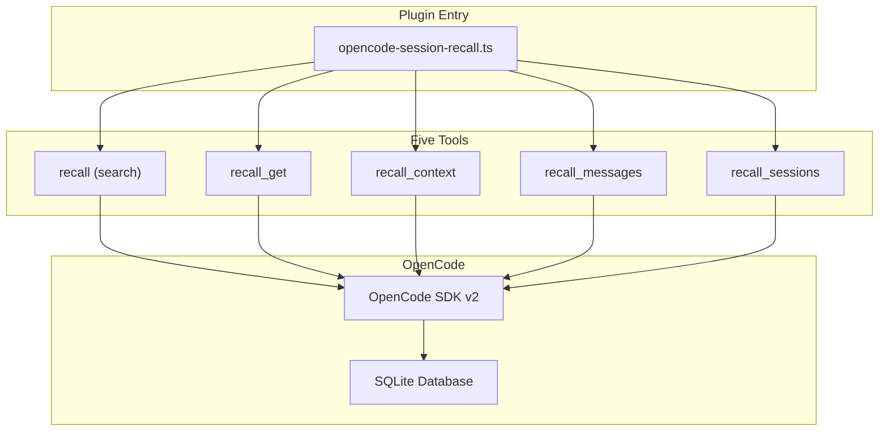
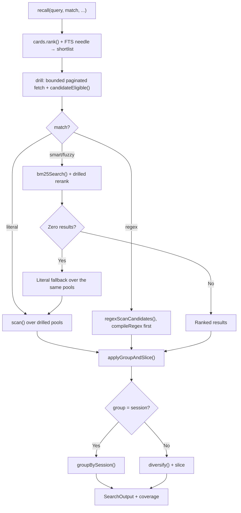
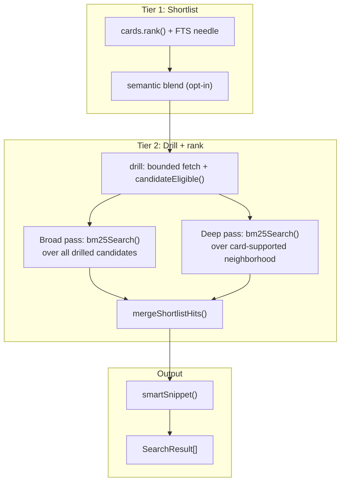
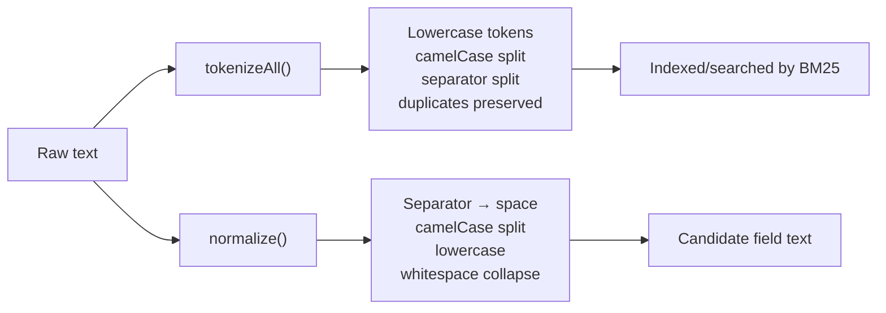

# Contributing to opencode-session-recall

## Development setup

```bash
git clone https://github.com/rmk40/opencode-session-recall.git
cd opencode-session-recall
npm install
npm run typecheck    # type-check without emitting
npm run compile      # build with tsup + tsc declarations
npm run dev          # run in opencode plugin dev mode
```

### Requirements

- Node.js 20+
- TypeScript 6+
- An [OpenCode](https://github.com/opencode-ai/opencode) installation (for live testing)

### Build

The project uses `tsup` for bundling and `tsc` for declaration files. ESM-only (`"type": "module"`). Strict TypeScript with `noUncheckedIndexedAccess`.

```bash
npm run typecheck && npm run compile
```

Output goes to `dist/`. The single entry point is `src/opencode-session-recall.ts`.

## Architecture

### High-level overview


```mermaid
flowchart TB
    subgraph "Plugin Entry"
        Entry["opencode-session-recall.ts"]
    end

    subgraph "Five Tools"
        Recall["recall (search)"]
        Get["recall_get"]
        Context["recall_context"]
        Messages["recall_messages"]
        Sessions["recall_sessions"]
    end

    subgraph "OpenCode"
        SDK["OpenCode SDK v2"]
        DB["SQLite Database"]
    end

    Entry --> Recall
    Entry --> Get
    Entry --> Context
    Entry --> Messages
    Entry --> Sessions

    Recall --> SDK
    Get --> SDK
    Context --> SDK
    Messages --> SDK
    Sessions --> SDK

    SDK --> DB
```

The plugin registers five tools via the OpenCode plugin API, plus optional event hooks for proactive recall (see [Invocation hooks](#invocation-hooks)). All data access goes through the OpenCode SDK — no direct database queries.

### Module map

| Module                       | Purpose                                                                                                                                     |
| ---------------------------- | ------------------------------------------------------------------------------------------------------------------------------------------- |
| `opencode-session-recall.ts` | Plugin entry point. Creates SDK clients, the shared fetch gate, card store, drill, and distiller; registers tools and hooks                 |
| `search.ts`                  | `recall` tool. Orchestrates the tiers (cards → slim FTS → drill), deep-sweep mode, literal/regex/smart paths, filters, expansion, grouping  |
| `store.ts`                   | SQLite card + slim-FTS store: schema, versioned migration (v1→v2 additive)/rebuild, per-session transactional replace, FTS query, lease     |
| `distill.ts`                 | The distiller: human-layer extractor, card builder, resumable cold pass, event-driven incremental updates, and `fetchMessagePage()`         |
| `summarize.ts`               | Opt-in Path B summarizer: a worker-session that batches card digests through a cheap model, content-hash gated, driven by the distiller     |
| `embedding-text.ts`          | `embeddingTextOf()`: the natural-language projection embedded for each card, plus the persisted-vector representation stamp                 |
| `cards.ts`                   | Tier-1 card runtime: MiniSearch over card fields (incl. `nl_summary`), metadata filters, family exclusion, optional semantic blend + rescue |
| `drill.ts`                   | Tier-2 bounded drill and the deep sweep: paginated fetch, budgets, drilled-session LRU, deep continuation cursor                            |
| `rerank.ts`                  | Two-stage drilled rerank (`mergeShortlistHits`): broad pass plus a shortlist-local deep pass over drilled candidates                        |
| `fetch-gate.ts`              | Shared fetch semaphore all SDK calls pass through; foreground queries have priority over the background distiller                           |
| `fetch-window.ts`            | Bounded newest-first message-window fetch for `recall_context` and inline expansion                                                         |
| `sqlite.ts`                  | Runtime-detected driver adapter: `bun:sqlite`, else `node:sqlite`, else null (degraded)                                                     |
| `corpus.ts`                  | Session-digest derivation and the embedder surface (the surviving remnant of the deleted CorpusCache)                                       |
| `extract.ts`                 | Text extraction from message parts. `searchableFields()`, `matches()`, `evidenceClassFor()`, `isSelfTool()`, `isSummarizerTitle()`          |
| `types.ts`                   | Shared types and `Limits`/`DEFAULTS`; defensive coercers (`coerceEnum`/`coerceInt`)                                                         |
| `sessions.ts`                | `recall_sessions` tool (card-backed enrichment, since/until)                                                                                |
| `get.ts`                     | `recall_get` tool                                                                                                                           |
| `context.ts`                 | `recall_context` tool                                                                                                                       |
| `messages.ts`                | `recall_messages` tool (cursor-paginated, newest-first)                                                                                     |
| `normalize.ts`               | Tokenizers/normalizer: `tokenizeAll()` (dup-preserving, for BM25) and `tokenize()` (deduped)                                                |
| `query.ts`                   | Query parsing: `parseQuery()` → `ParsedQuery` with raw, lower, tokens, phrases, codeTokens                                                  |
| `candidates.ts`              | Candidate construction over drilled messages; `candidateEligible()` query-time filter predicate                                             |
| `digest.ts`                  | Digest-token rules (`isDigestToken`, stopwords) shared by the distiller and session digests                                                 |
| `bm25.ts`                    | BM25 relevance ranking (MiniSearch) with structural boosts/penalties, applied within drilled sessions                                       |
| `node-import.ts`             | Dynamic `node:fs`/`node:path`/`node:os` loaders, so `src/` stays free of Node type deps                                                     |
| `semantic/embedder.ts`       | Opt-in static-embedding model: download, load, embed (the only Node-touching module)                                                        |
| `semantic/similarity.ts`     | Brute-force cosine similarity over card embeddings                                                                                          |
| `regex.ts`                   | `regex` match mode: pattern compile, bounded scan, match snippet                                                                            |
| `route.ts`                   | Query-shape classification (`looksLikeRegex`, `classifyQuery`) that drives mode suggestions                                                 |
| `snippet.ts`                 | Token-density sliding window snippet selection                                                                                              |
| `hooks/system-nudge.ts`      | `nudge` option: system-prompt reminder to use recall                                                                                        |
| `hooks/card-recall.ts`       | Shared zero-fetch card query (`cardRecall`) used by both proactive hooks                                                                    |
| `hooks/auto-recall.ts`       | `autoRecall` option: cue-gated card-tier recall on `chat.message`, injects cited hits                                                       |
| `hooks/compaction-recall.ts` | `compactionRecall` option: preserves the session's own card into the compaction summary                                                     |
| `hooks/part-id.ts`           | Generates opencode-compatible ascending `prt_` part IDs for injected synthetic parts                                                        |

### Search paths

Every search resolves a shortlist of sessions from the card store (tier 1) plus the slim FTS index (tier 1.5), then drills those sessions through the SDK under budgets (tier 2) and runs the match path over the drilled candidates. Query-time filters (`type`, `role`, `before`/`after`, `toolName`) are applied by the pure predicate `candidateEligible()` on each drilled session's candidates. `deep: true` replaces tier-1 selection with an exhaustive sweep of an explicitly scoped session set (see [Deep mode](#deep-mode)). From there, three distinct execution paths, selected by `match`:


```mermaid
flowchart TB
    Start["recall(query, match, ...)"] --> Rank["cards.rank() + FTS needle → shortlist"]
    Rank --> Drill["drill: bounded paginated fetch + candidateEligible()"]
    Drill --> Guard{"match?"}

    Guard -->|literal| Literal["scan() over drilled pools"]
    Guard -->|regex| Regex["regexScanCandidates(), compileRegex first"]
    Guard -->|smart/fuzzy| Smart["bm25Search() + drilled rerank"]

    Smart --> FallbackCheck{"Zero results?"}
    FallbackCheck -->|Yes| Fallback["Literal fallback over the same pools"]
    FallbackCheck -->|No| Ranked["Ranked results"]
    Fallback --> Literal

    Literal --> GroupSlice["applyGroupAndSlice()"]
    Regex --> GroupSlice
    Ranked --> GroupSlice

    GroupSlice --> GroupCheck{"group = session?"}
    GroupCheck -->|Yes| Group["groupBySession()"]
    GroupCheck -->|No| Diversify["diversify() + slice"]

    Group --> Out["SearchOutput + coverage"]
    Diversify --> Out
```

**Literal path** (`match: "literal"`, the default): `scan()` iterates the drilled candidates' field texts (`searchableFields()` output, built when the drill fetches each session) → `matches()` (case-insensitive `includes`). Drilled slices include tool outputs, so literal covers outputs within the drilled sessions. Stops once enough results are collected (the part path over-collects for diversity; grouped mode scans broadly). Available for all scopes.

**Regex path** (`match: "regex"`): The pattern is compiled once with `compileRegex()` up front, so an invalid pattern is a hard error before any scanning. `regexScanCandidates()` mirrors the literal scanner over the same drilled candidates but matches with the compiled `RegExp` and builds snippets via `regexSnippet()`. Bypasses BM25. Field text is length-capped per match; there is no per-match timeout (see `regex.ts` header).

**Smart/fuzzy path** (`match: "smart"` or `"fuzzy"`): `bm25Search()` ranks the drilled candidates, and the two-stage drilled rerank (`rerank.ts`) re-scores the card-supported neighborhood under its own term statistics (see [Smart/fuzzy pipeline](#smartfuzzy-pipeline)). Returns all ranked results; the caller slices and optionally groups. Falls back to the literal path over the same drilled pools if it finds nothing, so smart/fuzzy results that came from the fallback carry literal semantics (no `score`/`matchedTerms`).

**Session grouping** (`group: "session"`): `groupBySession()` collapses results to one entry per session, plus `hitCount`, `evidenceKinds`, and up to two `topEvidence` snippets of other evidence classes. The representative is chosen by evidence-class priority (`CLASS_PRIORITY`: human-text and tool-input before file-read, web-fetch, and skill-definition) among the tracked hits within `REPRESENTATIVE_TOLERANCE` of the session's best score, so a session isn't represented by its skill payload when a command hit scores nearly as well. In part mode, `diversify()` caps how many hits a single session contributes to the initial fill, and a final `capAndSlice()` pass caps generated reference material per class (`CLASS_CAPS`: one skill-definition, two file-read, two web-fetch) and guarantees one tool-input hit for command-like queries.

**Expansion** (`expand: "context"` or `"message"`): After filtering, grouping, and slicing, `expandSearchResults()` fetches messages on demand for only the expanded sessions and attaches an `expanded` array for the first `expandResults` final results. Context expansion marks the matched message with `center: true` and includes `hasMoreBefore` / `hasMoreAfter`. Each part is capped at `MAX_EXPANDED_PART_CHARS` (6,000) within the total budget; when the matched part itself is truncated, `truncatePreservingMatch()` (`snippet.ts`) keeps the head plus a window around the match instead of head-slicing the match away.

### Invocation hooks

Besides the five tools, the plugin optionally registers OpenCode event hooks so the agent uses recall proactively. They are wired in `opencode-session-recall.ts` and gated by plugin options. Each hook is fully wrapped in `try/catch`: OpenCode runs hooks through `Effect.promise`, where a thrown hook becomes a fatal defect, so the hooks must never throw.

| Hook                                 | Option (default)         | Module                       | Behavior                                                                                                  |
| ------------------------------------ | ------------------------ | ---------------------------- | --------------------------------------------------------------------------------------------------------- |
| `experimental.chat.system.transform` | `nudge` (on)             | `hooks/system-nudge.ts`      | Pushes one reminder string onto `output.system`; idempotent via a sentinel; guards entry types            |
| `chat.message`                       | `autoRecall` (off)       | `hooks/auto-recall.ts`       | Cue-gated card-tier recall; injects a cited synthetic text part into `output.parts`                       |
| `experimental.session.compacting`    | `compactionRecall` (off) | `hooks/compaction-recall.ts` | Reads the session's own distilled card; appends one cited block to `output.context` (never sets `prompt`) |

Both proactive hooks query the card tier directly through `cardRecall()` (`hooks/card-recall.ts`) and make zero message fetches. `autoRecall` ranks cards for a cue-derived query (excluding the current session's family) and injects the top few as a cited block; `compactionRecall` reads the current session's own card and preserves its durable fields (focus, outcome, errors, identifiers, files). There is no search-tool instance, no wall-clock timeout, and no shared cache to warm, so the `prewarm` option is now a retained no-op. `autoRecall` injects a `synthetic: true` text part carrying a real `prt_` id from `hooks/part-id.ts`, because the hook fires after OpenCode has already assigned ids to the message's other parts.

### Smart/fuzzy pipeline


```mermaid
flowchart TB
    subgraph "Tier 1: Shortlist"
        Rank["cards.rank() + FTS needle"]
        Rank --> Sem["semantic blend (opt-in)"]
    end

    subgraph "Tier 2: Drill + rank"
        Drill["drill: bounded fetch + candidateEligible()"]
        Drill --> Broad["Broad pass: bm25Search()<br/>over all drilled candidates"]
        Drill --> Deep["Deep pass: bm25Search()<br/>over card-supported neighborhood"]
        Broad --> Merge["mergeShortlistHits()"]
        Deep --> Merge
    end

    subgraph "Output"
        Snippet["smartSnippet()"]
        Snippet --> Results["SearchResult[]"]
    end

    Sem --> Drill
    Merge --> Snippet
```

#### Stage 1: Shortlist and drill (`cards.ts`, `drill.ts`, `candidates.ts`)

Tier 1 ranks the in-memory cards (`cards.rank()`), tier 1.5 adds any sessions whose slim FTS rows carry an anchor the card missed, and the two merge into a shortlist capped at `drillSessions` (default 12). Tier 2 (`drill.ts`) fetches those sessions in bounded newest-first pages through `fetchMessagePage()`, truncating each part to `MAX_CHARS_PER_CANDIDATE` immediately, and stops paging at the per-session budget or once pages stop matching any query anchor. For each drilled session, `buildCandidates()` scans messages newest-first: `searchableFields()` extracts each part's field texts (joined as `rawText`, tool outputs included), `tokenize()` produces the deduplicated token set, and `populateNormalized()` fills the indexed fields (camelCase splitting, separator → space, lowercase, whitespace collapse). Query-time filters (`type`, `role`, `before`/`after`, `toolName`) are the pure predicate `candidateEligible()`, applied to each drilled session's candidates.

The drill budgets (all plugin options, defaults from `DEFAULTS`):

| Limit                     | Default    | Purpose                                                |
| ------------------------- | ---------- | ------------------------------------------------------ |
| `drillSessions`           | 12         | Sessions a query drills into                           |
| `drillPageMessages`       | 25         | Messages per untargeted drill page                     |
| `drillCharsPerSession`    | 1,500,000  | Retained-chars budget per drilled session              |
| `drillCharsPerQuery`      | 20,000,000 | Retained-chars budget across one drill                 |
| `deepCharsPerQuery`       | 30,000,000 | Retained-chars budget for one deep sweep               |
| `cacheMaxChars`           | 24,000,000 | Drilled-session LRU budget (keeps repeat queries warm) |
| `MAX_CHARS_PER_CANDIDATE` | 20,000     | Truncate very long tool outputs per candidate          |

A small LRU keyed by `(sessionId, time.updated)` holds recently drilled sessions so repeat and refined queries stay warm; eviction only ever costs latency, never results, since an evicted session is re-fetched when drilled again. Each drilled session's `digestText` (the first user message's head plus its characteristic action vocabulary, with no credit for file reads or skill payloads) is stamped onto its candidates for ranking. The drill embeds nothing itself; the semantic blend is a card-tier concern only (Stage 3).

#### Stage 2: BM25 ranking, broad and deep (`bm25.ts`, `rerank.ts`)

A fresh in-memory MiniSearch index is built per query over the drilled candidates and discarded after (the drilled candidates live in the drill LRU; the index does not). MiniSearch provides BM25+ scoring, which weights rare terms (IDF) and normalizes for document length.

The index tokenizes with `tokenizeAll()` (the duplicate-preserving tokenizer, so term frequency stays meaningful). Field boosts:

| Field           | Boost | Source                         |
| --------------- | ----- | ------------------------------ |
| `primaryText`   | 2     | Normalized message/tool text   |
| `secondaryText` | 0.6   | Normalized project directory   |
| `digestText`    | 0.4   | Content-derived session digest |
| `titleText`     | 0.3   | Normalized session title       |
| `hintText`      | 0.15  | Normalized tool name           |

Search options: `combineWith: "OR"`, `prefix` for terms > 3 chars, and `fuzzy` for terms ≥ 4 chars (edit-distance fraction 0.2 for smart, 0.3 for fuzzy, capped by `maxFuzzy: 6`).

The ranking runs as two passes over the drilled pool (`rerank.ts`). The broad pass scores every drilled candidate; the deep pass re-scores only the card-supported neighborhood (the sessions tier 1's `cards.rank()` shortlisted) over a **second index built only from those sessions' candidates**. The second build is required, not an optimization choice, because MiniSearch fixes IDF at index-build time, so only a neighborhood-only index gives the deep pass shortlist-local term statistics. `mergeShortlistHits()` anchors each deep hit to its own session's broad-pass ceiling, applies `SHORTLIST_MULT` (×1.1) exactly once, and dedupes by `partID` keeping the higher score; a session whose broad hits were all dropped by the relative floor re-enters at floor level. This is the drilled-scope rerank, not the deleted corpus-wide windowing.

BM25 scores are normalized to 0..1 relative to the top hit, then adjusted by **multiplicative** structural boosts/penalties (converted from the prior additive model):

| Signal             | Multiplier | Condition                                                                    |
| ------------------ | ---------- | ---------------------------------------------------------------------------- |
| Exact phrase       | ×1.15      | Quoted phrase found verbatim in raw text                                     |
| Session digest     | ×1.15      | At least half the query tokens appear in the session digest                  |
| Exact code token   | ×1.12      | A code-like query token (compound, camelCase, CONSTANT) verbatim in raw text |
| All tokens matched | ×1.10      | Every query token present (exact or fuzzy)                                   |
| Tool input         | ×1.10      | Evidence class `tool-input` (matched in command/cwd/toolName fields)         |
| Reasoning part     | ×1.05      | Part type is `reasoning`                                                     |
| Error text         | ×1.05      | Tool output contains error-like patterns                                     |
| User role          | ×1.03      | Message authored by user                                                     |
| Recency            | ×1.00–1.05 | Decays linearly over 1 week                                                  |
| Weak single fuzzy  | ×0.90      | Single match, relative score < 0.7                                           |
| File read          | ×0.90      | Evidence class `file-read` (tool name suffix-matches `read`)                 |
| Skill definition   | ×0.85      | Evidence class `skill-definition` (tool name suffix-matches `skill`)         |
| Web fetch          | ×0.85      | Evidence class `web-fetch` (output match on fetch/scrape/search-shaped tool) |
| Poor coverage      | ×0.92      | < 50% of query tokens matched                                                |

The evidence class comes from `evidenceClassFor()` in `extract.ts`, derived deterministically from part type, tool name, and matched fields; it is also returned on every result as `why.evidenceClass`. Internal scores are deliberately **unclamped** — clamping per hit would erase every positive boost at the relative top — and are clamped to 0–1 once at output in `rankedToSearchResults()`.

A relative score floor (`MIN_RELATIVE_SCORE`) drops trailing noise from OR-combined weak single-term matches, but never drops the only/best hit. Results sort by score, then recency, then `partID` for deterministic ties. When `explain: true`, each adjustment is recorded in `matchReasons`, and the output carries `queryPlan` (`variants` is the capability inventory, `selected` records what actually ran).

Quoted phrases are soft signals, not hard constraints: `parseQuery()` turns them into ordinary tokens for BM25, and the exact-phrase multiplier rewards documents whose raw text contains the verbatim phrase.

#### Stage 3: Semantic blend (`semantic/`, opt-in, card tier)

Off unless the `semantic` plugin option is set, and it operates at the **card tier**, not the part level. `cards.ts` embeds each card's text once and blends the cosine similarity between the query vector and each card vector into that card's lexical score (weighted by `semanticWeight`). It is a mild reorderer, not a vocabulary-gap solver: card text is mostly identifiers, so real-corpus testing found the blend only nudges borderline paraphrases at the margin, and rephrasing the query stays the reliable path when wording diverges. Card vectors persist lazily to the `card.embedding` column, stamped with the model id in `meta.semantic_model`; a later process start reuses them when the stamp matches and the row still has a vector, and recomputes otherwise (a re-distilled card is upserted with a null embedding, so staleness self-heals). Final result ranking stays lexical over the drilled parts, so a session the embedding surfaced but whose drilled parts yield no lexical hit simply drops from the results. Any failure (model missing, embed error) leaves ranking exactly as the lexical path produced it, with one warning while the model is still loading. `semantic/embedder.ts` is the only module allowed to touch Node APIs, exclusively via dynamic `import()`, so non-Node runtimes and disabled installs degrade gracefully.

#### Stage 4: Snippet selection (`snippet.ts`)

`smartSnippet()` finds all positions of query tokens and phrases in the raw text, then uses a sliding window to select the span with the most distinct token matches. The window is centered on the densest cluster.

### Deep mode

Regular search reads tool outputs only within the sessions it drills into, so a needle that lives solely in a tool output of a session nothing else points at is the one thing tiers 1 through 2 cannot serve. `deep: true` is the explicit escape hatch (`drill.deep()`): it resolves an explicitly scoped session set (a `sessions` list, an explicit `sessionID`, or a lower time bound plus a project/directory constraint), sweeps every part of each scoped session including outputs, and ranks with the same match path as a normal query. It runs under `deepCharsPerQuery` and a soft wall-clock budget; when a budget stops it partway, it returns an opaque base64url continuation cursor (`encodeDeepCursor`) that the caller passes back as `deepCursor` to resume exactly where coverage stopped. A resumed cursor is validated defensively: session ids the store doesn't know are dropped with a warning and the resumed set is capped. A global unscoped deep is rejected with guidance. Coverage carries a `deep` block (sessions covered, partial, remaining) and the top-level `nextCursor`.

### Text normalization


```mermaid
flowchart LR
    Raw["Raw text"] --> TA["tokenizeAll()"]
    TA --> Tokens["Lowercase tokens<br/>camelCase split<br/>separator split<br/>duplicates preserved"]
    Tokens --> BM25["Indexed/searched by BM25"]

    Raw --> N["normalize()"]
    N --> Norm["Separator → space<br/>camelCase split<br/>lowercase<br/>whitespace collapse"]
    Norm --> Fields["Candidate field text"]
```

- `tokenizeAll()`: duplicate-preserving tokenizer used by the BM25 index and search so term frequency is meaningful.
- `tokenize()`: deduplicated variant used for set-membership checks (matched-term/field detection, query token uniqueness).
- `normalize()`: whitespace-collapsed normalized string used to populate the candidate fields the index reads.

### Dependencies

| Package               | Version | Purpose                                                           |
| --------------------- | ------- | ----------------------------------------------------------------- |
| `@opencode-ai/sdk`    | ^1.3.2  | OpenCode API client                                               |
| `minisearch`          | ^7.2.0  | BM25 relevance ranking for smart/fuzzy search                     |
| `fastest-levenshtein` | ^1.0.16 | Edit-distance for matched-term detection                          |
| `zod`                 | ^4.3.6  | Schema validation backing the `tool.schema` builder for tool args |

Peer dependency: `@opencode-ai/plugin` >= 1.2.0

### Type hierarchy

Key types across the codebase (`types.ts`, `candidates.ts`, `query.ts`):


```mermaid
classDiagram
    class SearchResult {
        +string sessionID
        +string sessionTitle
        +string directory
        +string messageID
        +string role
        +number time
        +string partID
        +string partType
        +boolean pruned
        +string snippet
        +string toolName
        +number score
        +MatchMode matchMode
        +string[] matchedTerms
        +string[] matchReasons
        +number hitCount
        +EvidenceClass[] evidenceKinds
        +TopEvidence[] topEvidence
        +ResultWhy why
    }

    class SearchOutput {
        +boolean ok
        +SearchResult[] results
        +ExpandedResult[] expanded
        +number total
        +boolean truncated
        +MatchMode matchMode
        +DegradeKind degradeKind
        +GroupMode group
        +SearchCoverage coverage
        +SearchSuggestion[] suggestions
        +QueryPlan queryPlan
    }
    note for SearchOutput "coverage carries the session/message/part\ncounts and loadErrors; queryPlan is\npresent only when explain:true."

    class ExpandedResult {
        +number resultIndex
        +string sessionID
        +string messageID
        +string mode
        +MessageItem[] messages
        +MessageItem message
        +boolean hasMoreBefore
        +boolean hasMoreAfter
    }

    class Candidate {
        +string sessionID
        +string messageID
        +string partID
        +string rawText
        +SearchableField[] fieldTexts
        +string[] tokens
        +string primaryText
        +string secondaryText
        +string titleText
        +string hintText
    }
    note for Candidate "Abbreviated. The full type also carries\nsessionTitle, directory, role, time, partType,\ntoolName, source, directoryRelevance, titleMatch.\nbm25.ts reads fieldTexts/directory/sessionTitle/toolName."

    class ParsedQuery {
        +string raw
        +string lower
        +string[] tokens
        +string[] phrases
    }

    SearchOutput --> SearchResult : contains
    SearchOutput --> ExpandedResult : optional
    SearchResult ..> Candidate : derived from
    Candidate ..> ParsedQuery : matched against
```

### Extending

#### Performance gates

`test/perf.test.ts` holds the plan's budgets, gated behind `RECALL_PERF=1` (machine-dependent wall-clock timing is off by default):

```bash
RECALL_PERF=1 npx vitest run test/perf.test.ts
```

It defends tier-1 card rank p95 under 50ms on ~4,700 cards, single-session distill+replace p50 under 150ms, `ftsSearch` over ~50k slim-index rows under 100ms, a drilled smart query end-to-end under 1.5s on a ~100-session store, and heap under 150MB. Run these when a change touches the store, the distiller, or the drill.

When changing ranking, re-run the relevance eval (`test/eval/`), which gates MRR, recall@5, and per-case `expect` clauses (excluded sessions, evidence classes in the top ranks) against `baseline.json` over a labeled corpus, plus an honest-miss and a degraded-mode assertion, so regressions fail the build.

#### Tuning ranking

All ranking constants are at the top of `bm25.ts`:

- `EXACT_PHRASE_MULT`, `ALL_TOKENS_MULT`, `REASONING_MULT`, etc. (multiplicative structural boosts)
- Evidence-class multipliers: `TOOL_INPUT_MULT`, `SKILL_DEFINITION_MULT`, `FILE_READ_MULT`
- `EXACT_TOKEN_MULT` rewards verbatim code-like tokens (`ParsedQuery.codeTokens`)
- `DIGEST_MATCH_MULT` fires when at least half the query tokens appear in the session digest
- `RECENCY_WINDOW_MS` controls how fast the recency boost decays
- `MIN_RELATIVE_SCORE` controls how aggressively weak OR-combined matches are dropped
- `fuzzyFor()` controls smart vs. fuzzy edit-distance tolerance

`SHORTLIST_MULT` (the drilled deep-pass lift) lives in `rerank.ts`; the card-tier field boosts and the code-token boost live in `cards.ts`. Note that internal scores are unclamped during ranking and merging; clamp only at output (`rankedToSearchResults()`), or positive boosts at the relative top are silently erased.

#### Adding a new tool

1. Create a new file in `src/` following the pattern in `get.ts` or `context.ts`
2. Export a function that takes SDK clients and returns a `ToolDefinition`
3. Register it in `opencode-session-recall.ts`
4. Add the tool name to the `TOOLS` array in `types.ts`

## Commit conventions

This project follows [Conventional Commits](https://www.conventionalcommits.org/):

```
<type>(scope): <summary>

<body>
```

Types: `feat`, `fix`, `docs`, `refactor`, `perf`, `test`, `chore`

Common scopes: `recall`, `search`, `bm25`, `snippet`, `types`

## License

MIT — see [LICENSE](LICENSE) for details.
